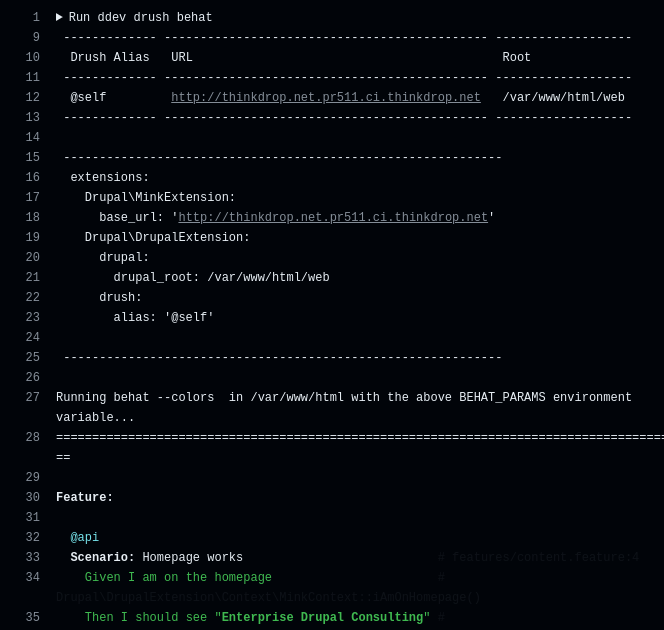

# Site Module


Drupal.org Module Page


<figure><figcaption>
Global site state indicators.
</figcaption></figure>

<figure><figcaption>
Site Entity with properties, state, and reason.
</figcaption></figure>

<figure><figcaption>
Site Entity history showing 
</figcaption></figure>

